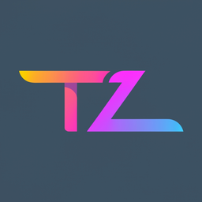

# TetraZero - Professional Portfolio Website

A modern, animated portfolio website built with Next.js 14, React 18, TypeScript, GSAP, and Tailwind CSS. Features smooth scroll animations, interactive particles, dark/light mode, and a fully responsive design.



## ✨ Features

### Core Functionality
- **Professional Portfolio Sections**: Hero, About, Skills, Projects, Experience, Contact
- **Smooth Scroll Animations**: Powered by GSAP and ScrollTrigger
- **Interactive Particle Background**: Dynamic tsparticles background with custom styling
- **Dark/Light Mode Toggle**: Theme switching with localStorage persistence
- **Responsive Design**: Mobile-first approach, fully responsive across all devices
- **Contact Form**: Functional contact form with validation (ready for email integration)
- **Project Filtering**: Filter projects by technology/category
- **SEO Optimized**: Meta tags, Open Graph, and semantic HTML

### Technical Features
- **Next.js 14**: Latest features including App Router
- **TypeScript**: Full type safety throughout the application
- **GSAP Animations**: Professional scroll-triggered animations
- **Component Architecture**: Modular, reusable components
- **Modern CSS**: CSS custom properties for theming
- **Performance Optimized**: Image optimization, lazy loading, code splitting

## 🚀 Getting Started

### Prerequisites
- Node.js 16+ 
- npm or yarn

### Installation

1. Clone the repository
2. Install dependencies:
```bash
npm install
```

3. Run the development server:
```bash
npm run dev
```

4. Open [http://localhost:3000](http://localhost:3000) in your browser

This project uses [`next/font`](https://nextjs.org/docs/basic-features/font-optimization) to automatically optimize and load Inter, a custom Google Font.

## Learn More

To learn more about Next.js, take a look at the following resources:

- [Next.js Documentation](https://nextjs.org/docs) - learn about Next.js features and API.
- [Learn Next.js](https://nextjs.org/learn) - an interactive Next.js tutorial.

You can check out [the Next.js GitHub repository](https://github.com/vercel/next.js/) - your feedback and contributions are welcome!

## Deploy on Vercel

The easiest way to deploy your Next.js app is to use the [Vercel Platform](https://vercel.com/new?utm_medium=default-template&filter=next.js&utm_source=create-next-app&utm_campaign=create-next-app-readme) from the creators of Next.js.

Check out our [Next.js deployment documentation](https://nextjs.org/docs/deployment) for more details.
